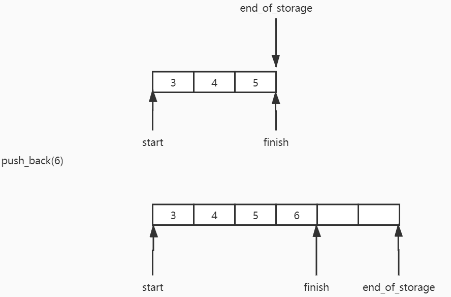
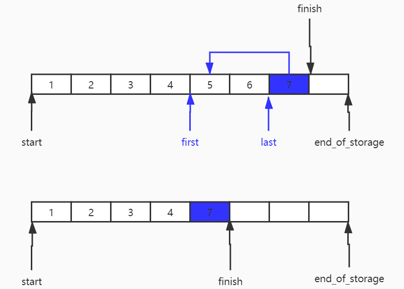
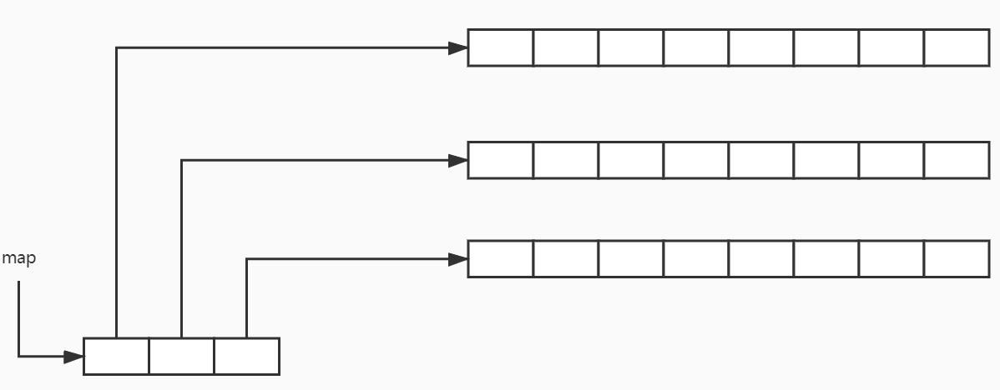
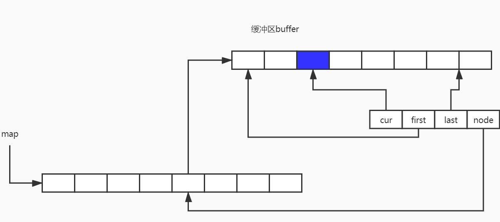

# 序列式容器

## `vector`

与普通数组非常相似, 优点是动态空间, 随着新元素的加入, 其内部机制会自动扩充. `vector` 的实现关键在于两点:

* 对容量大小的控制

* 重新配置时的数据移动效率

相信用过 `C++` 的人都用过 `vector` , 我们来看一下 `vector` 部分源代码:

```cpp
template <class T, class Alloc = alloc>  // T代表容器内嵌型别, 空间适配器默认使用第二级空间适配器 所以定义时可以 vector<int>
class vector {
    public:
    // 嵌套型别定义
    typedef T value_type;
    typedef value_type* pointer;
    typedef value_type* iterator;  // 迭代器是原生指针
    typedef value_type& reference;
    typedef size_t size_type;
    typedef ptrdiff_t difference_type;

    protected:

    typedef simple_alloc<value_type, Alloc> data_allocator;  // 空间配置器

    // 迭代器是原生指针 value_type*
    iterator start;  // 头
    iterator finish;  // 使用元素的尾部
    iterator end_of_storage;  // 可用空间的尾部
    ...
}
```

显然, 利用 `start` `finish` `end_of_storage` 很容易写出 `vector` 大小, 容量, 空容器的判断这些函数, 这里不再赘述.

缺省使用 `alloc` 做为空间配置器, 还定义了对应的 `simple_alloc` : `data_allocator` . 真正配置空间时使用 `data_allocator::allocate(n)` 等函数.

例如一个允许指定大小和初值的 `constructors` :

```cpp
vector(size_type n, const T& value) {  // 个数 n , 初值 value
    fill_initialize(n, value);  // 填充并初始化 显然还应该处理 vector 维护的数据结构, 如 start finish 等
}

void fill_ininialize(size_type n, const T& value) {
    start = allocate_and_fill(n, value);  // 分配空间并填初值 返回起始位置迭代器
    finish = start + n;
    end_of_storage = finish;
}

iterator allocate_and_fill(size_type n, const T& x) {
    // 第二章都有介绍
    iterator result = data_allocator::allocate(n);  // 分配 n * sizeof(T) 内存 返回头指针
    uninitialized_fill_n(result, n, x);  // 填充值 通过 traits 机制提升效率
    return result;
}
```

看几个经典的函数

 `push_back` :

```cpp
void push_back(const T& x) {
    if (finish != end_of_storage) {  // 还有空间
        construct(finish, x);
        finish++;
    }
    else {
        insert_aux(end(), x);  // 尾部
    }
}

// 指定位置插入值
template <class T, class Alloc>
void vector<T, Alloc>::insert_aux(iterator positon, const T& x) {
    if (finish != end_of_storage) {  // 还有空间
        construct(finish, *(finish-1));  // 最后一个元素复制到新的空间
        finish++;
        T x_copy = x;  // 要保存 x 的唯一可能是 x 很有可能是 vector 一个元素的引用 copy_backend 很有可能会修改
        copy_backend(positon, finish - 2, finish - 1);  // positon 到 finish - 2 往后移动
        *positon = x_copy;  // 赋值
    }
    else {  // 无多余空间
        const size_type old_size = size();
        const size_type len = old_size != 0 ? 2*old_size : 1;  // 初始是 0 就变为 1 不为 0 就 乘 2
        iterator new_start = data_allocator::allocate(n);  // 分配空间
        iterator new_finish = new_start;
        try {
            // 简单的复制
            new_finish = uninitialized_copy(start, positon, new_start);
            construct(new_finish, x);
            new_finish++;
            new_finish = uninitialized_copy(positon, finish, new_finish);
        }
        catch(...) {
            destroy(new_start, new_finish);  // 析构
            data_allocator::deallocate(new_start, len);  // 释放空间
            throw;
        }

        destroy(begin(), end());  // 原来的空间析构
        deallocate();  // 释放空间
        // 更新迭代器标志
        start = new_start;
        finish = new_finish;
        end_of_storage = new_start + len;
    }
}
```

可以通过下图理解:


`pop_back` :

```cpp
// 去掉尾端元素
void pop_back() {
    --finish;  // 更改尾部迭代器
    destroy(finish);  // 析构
}
```

`erase` :

```cpp
// 去掉指定区间所有元素
iterator erase(iterator first, iterator last) {
    iterator i = copy(last, finish, first);  // last 到 finish 之间的值移动到 first 之后
    destroy(i, finish);  // 析构 似乎会内存泄漏
    finish = finish - (last - first);  // 更改尾部迭代器
    return first;
}
```

可以通过下图来理解:



```cpp
// 清除某个位置的元素
iterator erase(iterator position) {
    if (positon + 1 != end()) {
        copy(position+1, finish, position);
    }
    finish--;
    destroy(finish);  // 似乎会内存泄漏
}

void clear() {
    erase(begin(), end());
}
```

`insert` :

```cpp
// 从 positon 开始 插入 n 个元素 初值为 x
template <class T, class Alloc>
void vector<T, Alloc>::insert(iterator position, size_type n, const T& x) {
    if (n != 0) {
        if (size_type(end_of_storage - finish) >= n) {  // 备用空间够
            T x_copy = x;
            const size_type elems_after = finish - position;  // 插入点离尾部的距离
            iterator old_finish = finish;
            if (elems_after > n) {
                uninitialized_copy(finish - n, finish, finish);  // 挪位置构造
                finish += n;
                copy_backend(position, old_finish - n, old_finish);  // 后移
                fill(position, position + n, x_copy);  // 填充
            }
            else {
                uninitialized_fill_n(finish, n - elems_after, x_copy);  // 填充值
                finish += n - elems_after;
                uninitialized_copy(position, old_finish, finish);  // 往后移
                finish += elems_after;
                fill(positon, old_finish, x_copy);  // 填充值
            }
        }
        else {  // 备用空间并不够用 需要额外配置
            const size_type old_size = size();
            const size_type len = old_size + max(old_size, n);  // 新长度 旧长度两倍 或者 旧长度 + 新增元素个数
            iterator new_start = data_allocator::allocate(len);  // 配置内存
            iterator new_finish = new_start;
            __STL_TRY {
                // [start, position) 直接 copy
                new_finish = uninitialized_copy(start, position, new_start);
                // insert n
                new_finish = uninitialized_fill_n(new_finish, n, x);
                // [position, finish) 直接 copy
                new_finish = uninitialized_copy(position, finish, new_finish);
            }
        # ifdef __STL_USE_EXCEPTIONS
            catch (...) {
                destroy(new_start, new_finish);  // 析构
                data_allocator::deallocate(new_start, len);  // 回收内存 注意范围
                throw;
            }
        # endif  /* _STL_USE_EXCEPTIONS */
            // 释放原来的 vector
            destroy(start, finish);
            deallocate();
            // 更新标记
            start = new_start;
            finish = new_finish;
            end_of_storage = new_start + len;
        }
    }
}
```

思想非常简单: 拷贝 赋值 更新标记 内存不够时重新申请一块 不再赘述.

## list

节点设计:

```cpp
// 双向链表
template <class T>
struct __list_node {
    typedef void* void_pointer;
    void_pointer prev;
    void_pointer next;
    T data;
}
```

迭代器设计

```cpp
template <class T, class Ref, class Ptr>
struct __list_iterator {
    typedef __list_iterator<T, T&, T*> iterator;
    typedef __list_iterator<T, Ref, Ptr> self;
    // traits 型别
    typedef bidirectional_iterator_tag iterator_category;
    typedef T value_type;
    typedef Ptr Pointer;
    typedef Ref reference;
    typedef __list_node<T>* link_type;
    typedef size_t size_type;
    typedef ptrdiff_t difference_type;

    link_type node;  // 指向节点的指针

    // constructor
    __list_iterator(link_type x) : node(x) {}  // 节点指针
    __list_iterator() {}
    __list_iterator(const iterator& x) : node(x.node) {}  // 拷贝构造
    //  == 看指向节点的指针
    bool operator==(const self& x) const {
        return node == x.node;
    }
    // != 看指向节点的指针
    bool operator!=(const self& x) const {
        return node != x.node;
    }
    // 解引用 得到节点的数据
    reference operator*() const {
        return (*node).data;
    }
    // -> 成员存取运算子的标准做法
    pointer operator->() const {
        return &(operator*());
    }
    // ++i
    self& operator++() {
        node = (link_type) ((*node).next());
        return *this;
    }
    // i++
    self operator++(int) {
        self tmp = *this;
        ++(*this);
        return tmp;
    }
    // --i
    self& operator--() {
        node = (link_type) ((*node).prev());
        return *this;
    }
    // i--
    self operator--(int) {
        self tmp = *this;
        --(*this);
        return tmp;
    }
}
```

`list` 的构造

```cpp
template <class T, class Allloc = alloc>  // 默认使用 alloc
class list {
    protected:

    link_type node;  // 节点指针
    typedef __list_node<T> list_node;
    typedef simple_alloc<list_node, Alloc> list_node_allocator;  // 空间配置器
    // 配置节点
    link_type get_node() {
        return list_node_allocator::allocate();
    }
    // 释放节点
    link_type put_node(link_type p) {
        return list_node_allocator::deallocate(p);
    }
    // 常见节点
    link_type create_node(const T& x) {
        link_type p = get_node();  // 分配内存
        construct(&p->data, x);  // 构造
        return p;
    }

    void destroy_node(link_type p) {
        destroy(&p->data);
        put_node(p);
    }
    // 初始化 一个节点
    void empty_initialize() {
        node = get_node();
        node->next = node;  // 双向链表
        node->prev = node;
    }

    iterator begin() {
        return (link_type)((*node).next);
    }

    iterator end() {
        return node;
    }

    bool empty() const {
        return node->next == node;
    }

    size_type size() const {
        size_type result = 0;
        distance(begin(), end(), result);  // 全局函数
        return result;
    }

    reference front() {
        return *(begin());
    }
    reference back() {
        return *(--end());
    }

    public:
    // constructor
    list() {
        empty_initialize();
    }

    typedef list_node* link_type;
}
```

`push_back` 函数:

```cpp
void push_back(const T& x) {
    insert(end(), x);  // 尾部迭代器 值
}

interator insert(iterator positon, const T& x) {
    // 双向链表串起来
    link_type tmp = create_node(x);
    tmp->next = positon.node;
    tmp->prev = position.node->prev;
    (link_type(positon.node->prev))->next = tmp;
    positon.node->prev = tmp;
    return tmp;
}
```

## `deque`

和 `vector` 比较而言, `deque` 属于双向开口的连续线性空间, 可以在头尾两端进行插入和删除操作.

`deque` 维护一段连续空间成为 `map` , `map` 中的每个元素指向另外一块较大的连续空间成为缓冲区, 缓冲区存放主体内容.

```cpp
templete <class T, class Alloc = alloc, size_t BufSiz = 0>
class deque {
    public:

    typedef  T value_type;
    typedef value_type* pointer;
    ...

    protected:

    typedef pointer* map_pointer;
    map_pointer map;  // 双重指针
    size_type map_size;  // map 大小
    ...
}
```

可以通过下图理解:


迭代器:

```cpp
template <class T, class Ref, class Ptr, size_t BufSiz>
struct __deque_iterator {
    typedef __deque_iterator<T, T&, T*, BufSize> iterator;
    typedef __deque_iterator<T, const T&, const T*, BufSiz> const_iterator;
    static size_t buffer_size() {
        return __deque_buf_size(BufSiz, sizeof(T));
    }
    // traits 型别
    typedef random_access_iterator_tag iterator_category;
    typedef T value_type;
    typedef Ptr Pointer;
    typedef Ref reference;
    typedef size_t size_type;
    typedef prtdiff_t difference_type;
    typedef T** map_pointer;
    typedef __deque_iterator self;


    T* cur;  // 当前所知元素的指针
    T* first;  // 缓冲区头部指针
    T* last;  // 缓冲区尾部指针
    map_pointer node;  // map 指针
    ...
}

// 全局函数
inline size_t __deque_buf_size(size_t n, size_t sz) {
    return n != 0 ? n : (sz < 512 ? size_t(512 / sz) : size_t(1));
}
```

可以通过下图来理解:



指针运算可能需要跳跃缓冲区

```cpp
// 更新 iterator 数据
void set_node(map_pointer new_node) {
    node = new_node;
    first = *new_node;
    last = first + difference_type(buffer_size());  // 末尾
}

// 重载运算符
reference operator*() const {
    return *cur;  // 迭代器解引用当然是当前元素
}

pointer operator->() const {
    return &(operator*());  // 当前元素的指针
}

difference_type operator-(const self& x) const {
    return difference_type(buffer_size()) * (node - x.node - 1) + (cur - first) + (x.last - x.cur))   // 计算缓冲区距离
}
// ++i
self& operator++() {
    cur++;
    if (cur == last) {  // 跳跃缓冲区
        set_node(node+1);
        cur = first;
    }
    return *this;
}
// i++
self operator++(int) {
    self tmp = *this;
    ++*this;
    return tmp;
}

self& operator--() {
    if (cur == first) {  // 跳跃缓冲区
        set_node(node-1);
        cur = last;
    }
    cur--;  // 切换到前一个
    return *this;
}
  // 固定写法
self operator--(int) {
    self tmp = *this;
    --*this;
    return tmp;
}

// 随机存取
self& operator+=(difference_type n) {
    difference_type offset = n + (cur - first);  // 与当前迭代器 first 的距离
    if (offset >= 0 && offset < difference_type(buffer_size())) {
        // 在当前缓冲区
        cur += n;
    }
    else {  // 跳跃
        difference_type node_offset = offset > 0 ? offset / difference_type(buffer_size()) : -difference_type((-offset - 1) / buffer_size()) - 1;  // node 的距离
        set_node(node + node_offset);  // 跳到新的缓冲区
        cur = first + (offset - node_offset * difference_type(buffer_size()));  // 设置新的当前的缓冲区元素指针
    }
    return *this;
}

self operator+(difference_type n) const {
    self tmp = *this;
    return tmp += n;
}

self& operator-=(difference_type n) const {
    return *this += -n;
}

self operator-(difference_type n) const {
    self tmp = *this;
    return tmp -= n;
}

reference operator[](difference_type n) const {
    return *(*this + n)
}

bool operator==(const self& x) const {
    // 两个迭代器相等判断 当前指针
    return cur == x.cur;
}

bool operator!=(const self& x) const {
    return !(*this == x);
}

bool operator<(const self& x) const {
    return (node == x.node) ? (cur < x.cur) : (node < x.node);  // 在整个 map 的先后次序
}
```

`deque` 的数据结构: `deque` 维护一个 `map` 指针, 还要维护两个迭代器, 分别指向第一个缓冲区的第一个元素和最后一个缓冲区的最后一个元素. 看代码:

```cpp
template <class T, class Alloc = alloc, size_t BufSiz = 0>
class deque {
    public:

    typedef T value_type;
    typedef value_type* pointer;
    typedef size_t size_type;
    typedef __deque_iterator<T, T&, T*, BufSiz> iterator;  // 参见迭代器实现可知 默认 512 bytes

    protected:

    typedef pointer* map_pointer;

    iterator start;
    iterator finish;
    map_pointer map;
    size_type map_size;

    // 这些操作很容易完成
    public:

    iterator begin() {return start;}
    iterator end() {return finish;}
    bool empty() const {return finish == start;}
    ...
}
```

`deque` 的构造

```cpp
// 两个空间配置器
protected:

typedef simple_alloc<value_type, Alloc> data_allocator;  // 配置元素
typedef simple_alloc<pointer, Alloc> map_allocator;  // 配置指针
// constructor
deque(int n, const value_type& value): start(), finish(), map(0), map_size(0) {
    fill_initialize(n, value);
}

template <class T, class Alloc, size_t BufSize>
void deque<T, Alloc, BufSize>::fill_initialize(size_type n, const value_type& value) {
    create_map_and_nodes(n);  // 分配内存
    map_pointer cur;
    __STL_TRY {
        for (cur = start.node; cur < finish.node; cur++) {
            uninitialized_fill(*cur, *cur + buffer_size(), value);  // 填充值
        }
        uninitialized_fill(finish.first, finish.cur, value);  // 最后一个填充到 cur 即可 create_map_and_nodes() 会更新
    }
    catch(...) {
        ...
    }
}

template <class T, class Alloc, size_t BufSize>
void deque<T, Alloc, BufSize>::create_map_and_nodes(size_type num_elements) {
    size_type num_nodes = num_elements / buffer_size() + 1;  // 整除会多分配一个 node
    map_size = max(initial_map_size(), nums_node + 2);  // 8 和 指定 node + 2 的最大值
    map = map_allocator::allocate(map_size);  // 分配 map 内存
    // nstart 和 nfinish 都在中间
    map_pointer nstart = map + (map_size - num_nodes) / 2;
    map_pointer nfinish = nstart + nums_nodes - 1;
    map_pointer cur;
    __STL_TRY {
        for (cur = nstart; cur <= nfinish; cur++) {
            *cur = allocate_node();  // 分配 node 内存
        }
    }
    catch(...) {
        ...
    }
    // 设置 start 和 finish 两个迭代器
    start.set_node(nstart);
    finish.set_node(nfinish);
    start.cur = start.first;  // start 的起始位置
    finish.cur = finish.first + nums_elements % buffer_size();  // 最后一个缓冲区拥有元素的最后一个位置的下一个位置
}
```

`push_back` 函数:

```cpp
void push_back(const value_type& t) {
    if (finish.cur != finish.last - 1) {
        // 缓冲区不是只有一个位置
        construct(finish.cur, t);
        ++finish.cur;
    }
    else {
        push_back_aux(t);
    }
}

void push_back_aux(const value_type& t) {
    value_type t_copy = t;
    reverse_map_at_back();  // 符合某种条件会换一个 map
    *(finish.node + 1) = allocate_node();  // 给后面的分配空间
    ___STL_TRY {
        construct(finish.cur, t_copy);  // 构造
        finish.set_node(finish.node + 1);  // 更新 finish.node
        finish.cur = finish.first;  // 更新 finish.cur
    }
    __STL_UNWIND(deallocate_node(*(finish.node + 1)));  // 释放空间
}

void reserve_map_at_back(size_type nodes_to_add = 1) {
    if (nodes_to_add + 1 > map_size - (finish.node - map)) {  // 未用的 node 太少
        reallocate_map(nodes_to_add, false);
    }
}

template <class T, class Alloc, size_t BufSize>
void deque<T, Alloc, BufSize>::reallocate_map(size_type nodes_to_add, bool add_at_front) {
    size_type old_num_nodes = finish.node - start.node + 1;  // 以前拥有的 node 个数
    size_type new_num_nodes = old_num_nodes + nodes_to_add;  // 新的 node 个数

    map_pointer new_nstart;
    if (map_size > 2 * new_num_nodes) {
        new_nstart = map + (map_size - new_num_nodes) / 2 + (add_at_front ? nodes_to_add : 0);
        if (new_nstart < start.node) {  // 往前移动需要从前到后复制
            copy(start.node, finish.node + 1, new_nstart);
        }
        else {
            copy_backend(start.node, finish.node + 1, new_nstart + old_num_nodes);  // 最后一个参数是尾指针
        }
    }
    else {
        size_type new_map_size = map_size + max(map_size, nodes_to_add) + 2;  // 新的 map_size
        map_pointer new_map = map_allocator::allocate(new_map_size);
        new_nstart = new_map + (new_map_size - new_num_nodes) / 2 + (add_at_front ? nodes_to_add : 0);
        copy(start.node, finish.node + 1, new_nstart);
        map_allocator::deallocate(map, map_size);  // 释放之前的内存
        map = new_map;  // 换成新的
        map_size = new_map_size;
    }
    // 更新迭代器
    start.set_node(new_nstart);
    finish.set_node(new_nstart + old_num_nodes - 1);
}
```

## `stack`

`SGI` 缺省使用 `deque` 作为 `stack` 的底部结构, 这种具有 "修改某物接口, 形成另一种风貌" 的性质称为配接器, 因此将 `SGI stack` 归类为 `container adapter` .

```cpp
// 基本完全使用 deque
template <class T, class Sequence = deque<T>>
class stack {
    friend bool operator==__STL_NULL_TMPL_ARGS(const stack&, const stack&);
    friend bool operator<__STL_NULL_TMPL_ARGS(const stack&, const stack&);
    public:
    // 直接使用 deque 的型别定义
    typedef typename Sequence::value_type value_type;
    typedef typename Sequence::size_type size_type;
    typedef typename Sequence::reference reference;
    typedef typename Sequence::const_reference const_reference;

    protected:
    Sequence c;  // 底层容器

    public:
    // 完全利用 deque
    bool empty() const {
        return c.empty();
    }

    size_type size() const {
        return c.size();
    }

    reference top() {
        return c.back();
    }

    const_reference top() const {
        return c.back();
    }

    void push(const value_type& x) {
        c.push_back(x);
    }

    void pop() {
        c.pop_back();
    }
};

// 通过 deque 判断
template <class T, clas Sequence>
bool operator==(const stack<T, Sequence>& x, const stack<T, Sequence>& y) {
    return x.c == y.c;
}

template <class T, clas Sequence>
bool operator<(const stack<T, Sequence>& x, const stack<T, Sequence>& y) {
    return x.c < y.c;
}
```

## `queue`

同样以 `deque` 作为底部结构:

```cpp
template <class T, class Sequence = deque<T>>
class queue {
    friend bool operator==__STL_NULL_TMPL_ARGS(const queue&, const queue&);
    friend bool operator<__STL_NULL_TMPL_ARGS(const queue&, const queue&);
    public:

    typedef typename Sequence::value_type value_type;
    typedef typename Sequence::size_type size_type;
    typedef typename Sequence::reference reference;
    typedef typename Sequence::const_reference const_reference;

    protected:
    Sequence c;

    public:

    bool empty() const {
        return c.empty();
    }

    size_type size() const {
        return c.size();
    }

    reference front() {
        return c.front();
    }

    const_reference front() const {
        return c.front();
    }

    reference back() {
        return c.back();
    }

    const_reference back() const {
        return c.back();
    }

    void push(const value_type& x) {
        c.push_back(x);  // 尾部添加
    }

    void pop() {
        c.pop_front();  // 头部出
    }
};

template <class T, class Sequence>
bool operator==(const queue<T, Sequence>& x, const queue<T, Sequence>& y) {
    return x.c == y.c;
}

template <class T, class Sequence>
bool operator<(const queue<T, Sequence>& x, const queue<T, Sequence>& y) {
    return x.c < y.c;
}
```

## `heap`

`heap` 本身并不属于 `STL` 容器组件, 它是下一节 `priority queue` 的助手.

```cpp
// push
template <class RandomAccessIterator>
inline void push_heap(RandomAccessIterator first, RandomAccessIterator last) {  // 头尾迭代器 尾部是所指数据末尾的下一个
    __push_heap_aux(first, last, distance_type(first), value_type(first));  // 头迭代器 尾迭代器 距离类型 数值类型
}

template <class RandomAccessIterator, class Distance, class T>
inline void __push_heap_aux(RandomAccessIterator first, RandomAccessIterator last, Distance*, T*) {
    __push_heap(first, Distance((last - first) -  1), Distance(0), T(*(last - 1)));  // 头迭代器 尾部索引 起始索引 尾部数值 (这里的索引是相对于头部迭代器)
}

// 实际 push 函数 从当前节点一直往上 遇到小的下移 遇到大的节点 将当前节点值填入其对应的 子节点 简单的 heap push 算法.
template <class RandomAccessIterator, class Distance, class T>
void __push_heap(RandomAccessIterator first, Distance holeIndex, Distance topIndex, T value) {
    Distance parent = (holeIndex - 1) / 2;  // 尾部的父节点
    while (holeIndex > topIndex && *(first + parent) < value) {  // 父节点小于新值
        *(first + holeIndex) = *(first + parent);  // 下移
        holeIndex = parent;  // 更新目标
        parent = (holeIndex - 1) / 2;  // 更新父节点
    }
    *(first + holeIndex) = value;  // 填入新的值 value
}
```

```cpp
// pop
template <class RandomAccessIterator>
inline void pop_heap(RandomAccessIterator first, RandomAccessIterator last) {  // 头部迭代器 尾部迭代器 尾部指向为最后一个元素的下个位置
    __push_heap_aux(first, last, value_type(first));  // 头 尾 值类型
}

template <class RandomAccessIterator, class T>
inline void __pop_heap_aux(RandomAccessIterator first, RandomAccessIterator last,  T*) {
    __pop_heap(first, last - 1, last - 1, T(*(last - 1)), distance_type(first));  // 头 含元素的尾部 存 pop 的迭代器 尾部值
}

template <class RandomAccessIterator, class Distance, class T>
void __pop_heap(RandomAccessIterator first, RandomAccessIterator last, RandomAccessIterator result, T value, Distance*) {
    *result = *first;  // 将 pop 存入末尾 尾部本来的值存于 value 中 所以不用担心覆盖
    __adjust_heap(first, Distance(0), Distance(last - first), value);  // 头迭代器 头索引 尾索引 要存入的值
}

template <class RandomAccessIterator, class Distance, class T>
void __adjust_heap(RandomAccessIterator first, Distance holeIndex, Distance len, T value) {
    Distance topIndex = holeIndex;
    Distance secondChild = 2 * holeIndex + 2;
    while (secondChild < len) {
        if (*(first + secondChild) < *(first + (secondChild - 1))) {
            secondChild--;  // 取左右子树的最大值
        }
        *(first + holeIndex) = *(first + secondChild);  // 上移
        holeIndex = secondIndex;  // 往下移动
        secondChild = 2 * (secondChild + 1);
    }
    if (secondChild == len) {  // 没有右子节点只有左子节点的情况
        *(first + holeIndex) = *(first + (secondChild - 1));  // 一定是加到叶子节点所以不用判断 直接上移
        holeIndex = secondChild - 1;
    }
    // 插入 value
    *(first + holeIndex) = value;  // 我觉得应该加这一句
    ...
}
```

```cpp
// sort
template <class RandomAccessIterator>
void sort_heap(RandomAccessIterator first, RandomAccessIterator last) {
    while (last - first > 1) {
        pop_heap(first, last--);  // 一直 pop 即可
    }
}
```

```cpp
// make 将一组数据排列为一段 heap
template <class RandomAccessIterator>
inline void make_heap(RandomAccessIterator first, RandomAccessIterator last) {
    __make_heap(first, last, value_type(first), distance_type(first));
}

template <class RandomAccessIterator, class T, class Distance>
void __make_heap(RandomAccessIterator first, RandomAccessIterator last, Distance*, T*) {
    if (last - first < 2) {  // 0 1 不用做什么
        return;
    }
    Distance len = last - first;
    Distance parent = (len - 2) / 2;
    while (true) {
        __adjust_heap(first, parent, len, T(*(first + parent)));  // 从最后一个节点的父节点开始一直调整
        if (parent == 0) {
            return;
        }
        parent--;  // 往头节点方向
    }
}
```

## `priority_queue`

`priority_queue` 完全以底部 `vector` 为容器, 加上 `heap` 的处理规则, 所以视为 `adapter` . 看源代码:

```cpp
template <class T, class Sequence = Vector<T>, class Compare = less<typename Sequence::value_type>>
class priority_queue {
    public:
    // 直接使用 deque
    typedef typename Sequence::value_type value_type;
    typedef typename Sequence::size_type size_type;
    typedef typename Sequence::reference reference;
    typedef typename Sequence::const_reference const_reference;

    protected:

    Sequence c;  // 底层容器
    Compare comp;  // 比较标准

    public:

    priority_queue() : c() {}
    explicit priority_queue(const compare& x) : c(), comp(x) {}  // explicit 可以理解为禁止隐式复制

    template <class InputIterator>
    priority_queue(InputIterator first, InputIterator last, const compare& x) : c(first, last), comp(x) {
        make_heap(c.begin(), c.end(), comp);  // 构建 heap
    }

    template <class InputIterator>
    priority_queue(InputIterator first, InputIterator last) : c(first, last) {
        make_heap(c.begin(), c.end(), comp);  // 默认比较标准
    }
    // 相应操作转为底层容器操作
    bool empty() const {
        return c.empty();
    }

    size_type size() const {
        return c.size();
    }

    const_reference top() const {  // 常量引用
        return c.front();
    }

    void push(const value_type& x) {
        __STL_TRY {
            c.push_back(x);  // vector push
            push_heap(c.begin(), c.end(), comp);  // 调整堆 调用此函数 x 已经插入
        }
        __STL_UNWIND(c.clear());
    }

    void pop() {
        __STL_TRY {
            pop_heap(c.begin(), c.end(), comp);  // heap pop 维护堆
            c.pop_back();  // 末尾为目标值
        }
        __STL_UNWIND(c.clear());
    }
};
```

## `slist`

`slist` 是单向链表, 迭代器是单向的 `Forward Iterator` , 这种数据结构并不在标准规格之内.

节点结构:

```cpp
struct __slist_node_base {
    __slist_node_base* next;
};

template <class T>
struct __slist_node : public __slist_node_base {  // 继承
    T data;
};

inline __slist_node_base* __slist_make_link(__slist_node_base* prev_node, __slist_node_base* new_node) {  // prev 之后插入 new
    new_node->next = prev_node->next;
    prev_node->next = new_node;
    return new_node;
}

inline size_t __slist_size(__slist_node_base* node) {  // 单链表长度 直接遍历
    size_t result = 0;
    for (; node!=0; node = node->next) {
        result++;
    }
    return result;
}
```

迭代器:

```cpp
struct __slist_iterator_base {
    typedef size_t size_type;
    typedef ptrdiff_t difference_type;
    typedef forward_iterator_tag iterator_category;  // 迭代器单向

    __slist_node_base* node;  // 节点的父类指针

    __slist_iterator_base(__slist_iterator_base* x) : node(x) {}

    void incr() {node = node->next;}
    // 重载 == 和 != 根据类里面的指针本身是否相等
    bool operator==(const __slist_iterator_base& x) const {
        return node == x.node;
    }

    bool operator!=(const __slist_iterator_base& x) const {
        return node != x.node;
    }
};

template <class T, class Ref, class Ptr>
struct __slist_iterator : public : __slist_iterator_base {  // 继承
    typedef __slist_iterator<T, T&, T*> iterator;
    typedef __slist_iterator<T, const T&, const T*> const_iterator;
    typedef __slist_iterator<T, Ref, Ptr> self;

    typedef T value_type;
    typedef Ptr pointer;
    typedef Ref reference;
    typedef __slist_node<T> list_node;

    // 实际通过继承的类来构造
    __slist_iterator(list_node* x) : __slist_iterator_base(x) {}
    __slist_iterator() : __slist_iterator_base(0) {}
    __slist_iterator(const iterator& x) : __slist_iterator_base(x.node) {}

    reference operator*() const {
        return ((list_node*) node->data);  // 子类型才有 data 属性 所以需要强制转换
    }

    Pointer operator->() const {
        return &(operator*());
    }

    self& operator++() {
        incr();  // 前进一个节点
        return *this;
    }
    self operator++(int) {
        self tmp = *this;
        incr();
        return tmp;
    }
};
```

`slist` 数据结构 :

```cpp
template <class T, class Alloc = alloc>
class slist {
    public:
    // traits 型别
    typedef T value_type;
    typedef value_type* pointer;
    typedef const value_type* const_pointer;
    typedef value_type& reference;
    typedef const value_type& const_reference;
    typedef size_t size_type;
    typedef ptrdiff_t difference_type;

    typedef __slist_iterator<T, T&. T*> iterator;
    typedef __slist_iterator<T, const T&, const T*> const_iterator;

    private:

    typedef __slist_node<T> list_node;
    typedef __slist_node_base list_node_base;
    typedef __slist_iterator iterator_base;
    typedef simple_alloc<list_node, Alloc> list_node_allocator;

    static list_node* create_node(const value_type& x) {
        list_node* node = list_node_allocator::allocate();  // 分配空间
        __STL_TRY_ {
            construct(&node->data, x);  // 填充值
            node->next = 0;
        }
        __STL_UNWIND(list_node_allocator::deallocate(node));
        return node;
    }

    static void destroy_node(list_node* node) {
        destroy(&node->data);
        list_node_allocator::deallocate(node);
    }

    private:

    list_node_base head;  // 数据成员 节点 head

    public:

    slist() {
        head.next = 0;
    }

    ~slist() {
        clear();
    }

    public:

    iterator begin() {
        return iterator((list_node*)head.next);
    }

    iterator end() {
        return iterator(0);
    }

    size_type size() const {
        return __slist_size(head.next);
    }

    bool empty() const {
        return head.next == 0;
    }

    void swap(slist& L) {
        list_node_base* tmp = head.next;
        head.next = L.head.next;
        L.head.next = tmp;
    }

    public:

    reference front() {
        return ((list_node*)head.next)->data;
    }

    void push_front(const valur_type& x) {
        __slist_make_link(&head, create_node(x));
    }

    void pop_front() {  // head 往后指 销毁
        list_node* node = (list_node*) head.next;
        head.next = node->next;
        destroy_node(node);
    }
    ...
};
```
